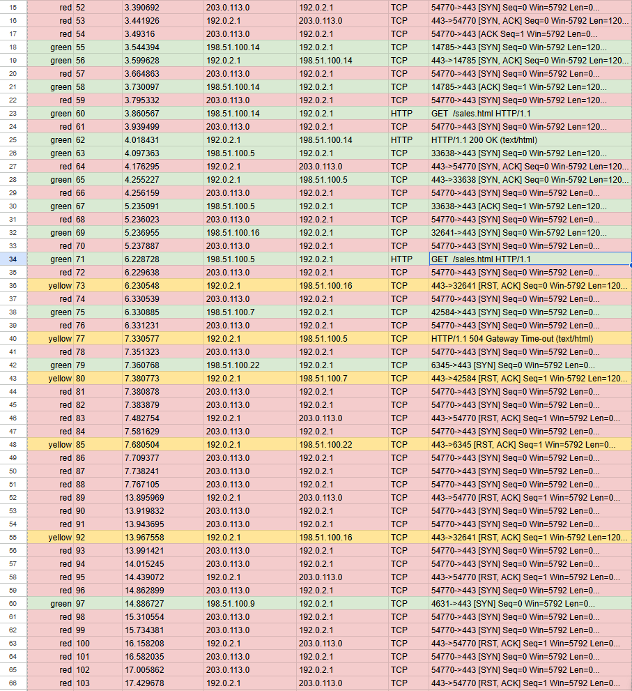

# Network Attack Analysis: TCP SYN Flood DoS Incident

## Objective

This project was completed as part of the Google Cybersecurity Professional Certificate.

The objective was to analyse a simulated network attack against a company web server, identify the likely type of attack, explain how it affected the server, and write a short incident report suitable for escalation to a manager or technical team.

The activity focused on recognising the symptoms of a denial of service attack, understanding how TCP SYN flooding works, interpreting packet capture evidence, and explaining the impact on legitimate users and business operations.

---

## Scenario

In this scenario, a travel agency’s website became unavailable to employees who regularly used it to search for vacation packages for customers.

An automated monitoring alert reported a problem with the web server. When attempting to visit the website, the browser returned a connection timeout error.

A packet capture was reviewed to investigate the issue. The traffic showed a large number of TCP SYN requests coming from an unfamiliar IP address. The web server appeared to become overwhelmed by the volume of incoming SYN requests and was unable to respond normally to legitimate connection attempts.

As an immediate response, the server was temporarily taken offline so it could recover, and the company firewall was configured to block the suspicious source IP address.

---

## Attack Identified

The likely attack was a:

`TCP SYN flood denial of service attack`

A SYN flood is a type of DoS attack that abuses the normal TCP three-way handshake process.

Instead of completing the connection, the attacker sends a large number of SYN requests and leaves the server waiting for the final ACK response. This causes the server to reserve resources for incomplete connections.

If enough incomplete connection requests are created, the server can become overwhelmed and unable to respond to legitimate users.

---

## TCP Three-Way Handshake

Under normal conditions, a TCP connection is established using a three-way handshake:

| Step    | Description                                                                                            |
| ------- | ------------------------------------------------------------------------------------------------------ |
| SYN     | The client sends a SYN request to the server to begin a connection.                                    |
| SYN-ACK | The server replies with a SYN-ACK to acknowledge the request and reserve resources for the connection. |
| ACK     | The client sends a final ACK to complete the connection.                                               |

In a SYN flood attack, the attacker sends repeated SYN requests but does not complete the handshake properly.

This leaves the server with a growing number of half-open connections.

---

## Supporting Evidence

The packet capture evidence was provided as a simulated Wireshark TCP/HTTP log.

The log showed repeated TCP SYN requests from the unfamiliar IP address `203.0.113.0` to the web server `192.0.2.1` over port `443`.

This pattern supported the conclusion that the web server was experiencing a TCP SYN flood denial of service attack.

* [Wireshark TCP/HTTP log](./wireshark-tcp-http-log.xlsx)

*Ref 1: Wireshark TCP/HTTP log showing repeated SYN requests during the suspected SYN flood incident.*

---

## Evidence from the Log Analysis

The packet capture showed repeated TCP SYN requests from an unfamiliar IP address:

`203.0.113.0`

The traffic was directed at the web server:

`192.0.2.1`

The traffic was sent over port:

`443`

Port 443 is commonly used for HTTPS web traffic.

The pattern suggested that the attacker was attempting to overwhelm the web server by sending repeated connection requests. After the volume of SYN requests increased, the server began failing to respond normally to legitimate web requests, causing connection timeout errors.

The log also showed that normal traffic initially completed successfully, but the web server later became unable to keep up with the volume of incoming SYN requests.

---

## Impact on the Web Server

The SYN flood affected the web server by consuming resources that would normally be used to handle legitimate TCP connections.

As the server became overwhelmed by incomplete connection attempts, it could no longer respond properly to normal users trying to access the website.

This caused users to receive connection timeout errors when attempting to load the website.

---

## Impact on the Organisation

The attack affected the organisation by interrupting access to the travel agency’s website.

Employees used the website to search for vacation packages for customers, so the outage could delay customer support, reduce productivity and potentially affect sales.

If the attack continued for a longer period, it could also damage customer trust and create additional pressure on technical support teams.

---

## Immediate Response

The immediate response included:

* Temporarily taking the web server offline so it could recover
* Blocking the suspicious source IP address at the firewall
* Escalating the issue to management and the relevant technical team

Blocking the IP address was useful as a short-term containment step, but it would not be a complete long-term solution because attackers can use spoofed or changing source IP addresses.

---

## Recommended Next Steps

Recommended next steps included:

1. Review firewall and server logs to confirm the scope of the attack
2. Enable or review SYN flood protection features
3. Consider enabling SYN cookies at the operating system or firewall level
4. Configure rate limiting for abnormal volumes of SYN requests
5. Use intrusion detection or prevention tools to identify similar traffic patterns
6. Consider using a reverse proxy or DDoS protection service to absorb malicious traffic
7. Monitor for additional suspicious source IPs
8. Document the incident and update response procedures

---

## Skills Learned

This project helped me practise:

* Identifying denial of service attack symptoms
* Recognising TCP SYN flood behaviour
* Understanding the TCP three-way handshake
* Interpreting packet capture patterns
* Connecting network traffic patterns to server impact
* Explaining technical findings clearly
* Considering short-term containment and longer-term mitigation
* Writing a cybersecurity incident report

---

## Security Concepts Practised

This activity helped reinforce:

* Denial of service attacks
* TCP connection handling
* SYN flooding
* Half-open connections
* Web server availability
* Firewall blocking
* Rate limiting
* Incident escalation
* Business impact of service disruption

---

## What I Learned

This project helped me understand how a relatively simple network attack can have a major impact on service availability.

The key learning point was that a SYN flood does not need to break into a server or steal data to be damaging. By overwhelming the server with incomplete connection requests, an attacker can prevent legitimate users from accessing the website.

It also showed the importance of understanding normal network behaviour. Knowing how the TCP three-way handshake works made it easier to recognise why repeated SYN requests without completed connections were suspicious.

This activity also reinforced that short-term containment is not the same as long-term prevention. Blocking one source IP can help temporarily, but stronger mitigations such as rate limiting, SYN flood protection, IDS/IPS monitoring or DDoS protection may be needed to reduce the risk of the same attack happening again.
