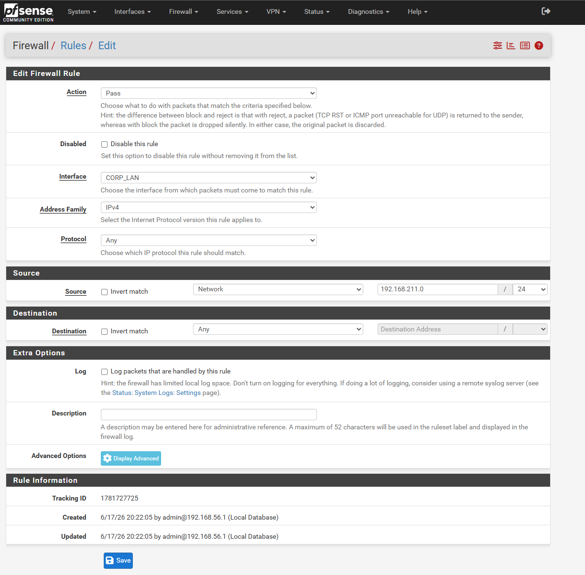

# pfSense Firewall Configuration

## Purpose

This page documents the pfSense firewall and router configuration used in my virtual cyber security home lab.

pfSense acts as the central routing point between the lab networks. It separates the management network, corporate LAN and attacker zone, while also allowing controlled outbound access to the internet through VirtualBox NAT.

The aim of this part of the build was to practise firewall setup, interface assignment, IP addressing, DHCP configuration, routing and firewall rule management.

---

## Role of pfSense in the Lab

pfSense was used as the main gateway for each internal lab network.

It provides:

* Routing between virtual network zones
* Default gateway services for lab hosts
* DHCP services for selected networks
* Firewall rule control between zones
* Controlled outbound internet access through NAT
* A central point for testing network segmentation and traffic flow

---

## Virtual Machine Configuration

pfSense was deployed as a virtual machine in Oracle VirtualBox.

The virtual machine was configured with:

| Setting               | Configuration  |
| --------------------- | -------------- |
| Operating system type | FreeBSD 64-bit |
| RAM                   | 1 GB           |
| Virtual disk          | 20 GB          |
| Network adapters      | 4 virtual NICs |

---

## Interface Layout

The pfSense VM was configured with four network adapters.

| Adapter   | pfSense Interface | VirtualBox Network   | Purpose                               |
| --------- | ----------------- | -------------------- | ------------------------------------- |
| Adapter 1 | WAN               | NAT                  | Outbound internet access              |
| Adapter 2 | LAN / Management  | Host-Only Adapter #1 | pfSense management and Splunk network |
| Adapter 3 | CORP_LAN          | Host-Only Adapter #2 | Corporate domain network              |
| Adapter 4 | ATTACKER_ZONE     | Host-Only Adapter #3 | Kali Linux testing network            |

---

## IP Addressing

Each internal pfSense interface was configured with a static gateway IP address.

| Interface        | Network            | pfSense Gateway IP |
| ---------------- | ------------------ | ------------------ |
| LAN / Management | `192.168.56.0/24`  | `192.168.56.254`   |
| CORP_LAN         | `192.168.211.0/24` | `192.168.211.254`  |
| ATTACKER_ZONE    | `192.168.100.0/24` | `192.168.100.254`  |

The WAN interface was connected to VirtualBox NAT so the lab could reach the internet for updates and downloads without exposing the lab directly to my home network.

---

## Initial Console Configuration

After installation, the pfSense console was used to configure the initial LAN management address.

The default LAN configuration was changed to:

`192.168.56.254/24`

This allowed the pfSense web interface to be accessed from the management network.

The web interface was then accessed from the host using:

`https://192.168.56.254`

---

## Web GUI Configuration

Once the web interface was accessible, the pfSense setup wizard was used to complete the initial configuration.

The optional interfaces were then assigned and renamed as:

* `CORP_LAN`
* `ATTACKER_ZONE`

Each interface was given a static IPv4 address so it could act as the gateway for its network.

---

## DHCP Configuration

DHCP was enabled for the lab networks where dynamic addressing was useful.

| Interface        | DHCP Range           |
| ---------------- | -------------------- |
| LAN / Management | `192.168.56.50-150`  |
| CORP_LAN         | `192.168.211.50-150` |
| ATTACKER_ZONE    | `192.168.100.50-150` |

Some key infrastructure systems were given static IP addresses instead of using DHCP.

Examples:

| Host              | Static IP        |
| ----------------- | ---------------- |
| Splunk Server     | `192.168.56.50`  |
| Domain Controller | `192.168.211.10` |

---

## Firewall Rules

Firewall rules were created to allow controlled traffic between lab networks for testing and validation.

The `CORP_LAN` and `ATTACKER_ZONE` interfaces were configured with outbound rules to allow traffic to pass through pfSense during the build.

*Ref 1: pfSense firewall rule configured for the CORP_LAN interface.*

This allowed the lab to confirm routing, connectivity and log generation between the attacker zone and the corporate LAN.

---

## WAN Configuration Note

Because pfSense was running behind VirtualBox NAT, standard private network blocking on the WAN interface needed to be adjusted.

In a normal physical deployment, blocking private networks on WAN interfaces is often desirable. In this virtual lab, the WAN interface was already behind VirtualBox NAT, so allowing this traffic was required for the lab to reach the internet correctly.

---

## Troubleshooting Notes

### Hardware offloading and poor network performance

During the initial setup, network performance through pfSense was extremely poor. Ubuntu package updates timed out and large downloads for Windows evaluation media stalled or failed.

The issue only happened when traffic was routed through the pfSense gateway.

After investigating, I found that this was caused by a mismatch between pfSense hardware offloading features and the VirtualBox virtual network adapters. pfSense was attempting to offload packet processing tasks to virtual NICs, but because the lab was running inside VirtualBox, those offloading features caused packets to be dropped or processed incorrectly.

To fix this, I accessed the pfSense web interface and disabled the following options under the networking settings:

* Hardware checksum offloading
* Hardware TCP segmentation offloading
* Hardware large receive offloading

After saving the changes and rebooting pfSense, network performance returned to normal.

This was a useful troubleshooting step because it showed that performance problems in a virtual lab can come from the virtualisation layer rather than the guest operating systems themselves.

---

### DHCP issue after changing the management subnet

Another issue occurred after changing the pfSense LAN interface from its default subnet to the custom management network:

`192.168.56.254/24`

After this change, new virtual machines connected to the management network could not automatically receive an IPv4 address. The Ubuntu Server installer failed during automatic network configuration because no DHCP lease was being provided.

The cause was that the pfSense DHCP service was still tied to the old default subnet configuration. After changing the LAN interface IP, the DHCP pool no longer matched the active network.

To work around this during installation, I manually configured the Ubuntu Server network settings:

| Setting   | Value                |
| --------- | -------------------- |
| Subnet    | `192.168.56.0/24`    |
| Static IP | `192.168.56.50`      |
| Gateway   | `192.168.56.254`     |
| DNS       | `1.1.1.1`, `8.8.8.8` |

Once Ubuntu was installed and the pfSense web interface was accessible, I corrected the DHCP scope under the pfSense DHCP server settings.

The management DHCP range was updated to:

`192.168.56.50-192.168.56.150`

After correcting the DHCP range, the DHCP service worked properly for future systems on that network.

---

## Validation Checks

After configuring pfSense, I validated that:

* The pfSense web interface was reachable from the management network
* The Splunk server could use the management network
* The corporate LAN had a working gateway
* The attacker zone had a working gateway
* Lab systems could route traffic through pfSense
* Internal traffic could be controlled using firewall rules
* Outbound internet access worked for updates and package downloads

---

## Skills Practised

This part of the project helped me practise:

* pfSense installation and setup
* Virtual firewall configuration
* Interface assignment
* Static IP addressing
* DHCP range configuration
* Default gateway configuration
* Routing between internal networks
* Firewall rule creation
* Troubleshooting network connectivity
* Understanding the difference between lab requirements and production firewall defaults

---

## What I Learned

This part of the lab helped me understand how important the firewall/router is in a segmented environment.

pfSense became the central control point for the lab. Every network zone depended on the correct interface assignment, gateway configuration, DHCP settings and firewall rules.

The troubleshooting process also reinforced that virtual lab environments can behave differently from physical networks. The hardware offloading issue was a useful reminder that network performance problems can sometimes come from the virtualisation layer rather than the guest operating systems themselves.

I also learned that changing an interface address can affect supporting services such as DHCP. The interface IP, subnet and DHCP scope all need to match, otherwise new systems may fail to obtain network settings automatically.
