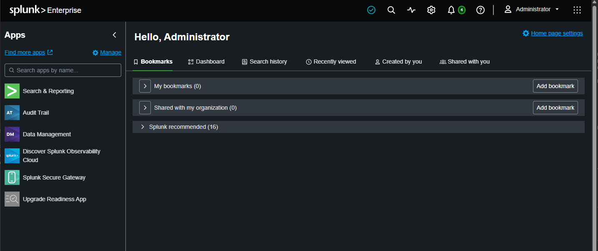

# Splunk SIEM Setup

## Purpose

This page documents the Splunk Enterprise SIEM setup used in my virtual cyber security home lab.

The aim of this part of the project was to build practical familiarity with SIEM tooling, using Splunk as the main log analysis platform. Splunk is widely used in security operations environments, so I wanted to gain hands-on experience with installing it, configuring it, receiving logs, searching indexed data and using it to support basic detection work.

This project helped me move beyond theory by giving me a working SIEM environment where I could collect Windows telemetry, search event data and begin understanding how analysts use logs during investigations.

In future, I may build similar lab exercises using other SIEM and security monitoring tools, such as Microsoft Sentinel, to broaden my experience across different platforms.

---

## Role of Splunk in the Lab

Splunk was used to provide centralised visibility across the Windows domain environment.

In this lab, Splunk was used to:

* Receive forwarded Windows logs
* Store Windows event data in a dedicated index
* Search and review endpoint telemetry
* Analyse events from the domain controller and Windows client
* Support later detection work using SPL queries
* Validate that security activity could be collected and investigated centrally

---

## Splunk Server Overview

| Item                  | Configuration                 |
| --------------------- | ----------------------------- |
| Host role             | Splunk Enterprise SIEM server |
| Operating system      | Ubuntu Server                 |
| Network zone          | Management Network            |
| Static IP address     | `192.168.56.50`               |
| Default gateway       | `192.168.56.254`              |
| Splunk web port       | `8000`                        |
| Splunk receiving port | `9997`                        |
| Custom index          | `windows`                     |

The Splunk server was placed on the management network so that monitoring infrastructure was separated from the corporate LAN and attacker zone.

---

## Ubuntu Server Setup

Splunk Enterprise was installed on a minimal Ubuntu Server virtual machine.

A headless server installation was used to keep the VM lightweight and reduce unnecessary resource usage.

The server was configured with a static IP address:

`192.168.56.50`

The pfSense management gateway was configured as:

`192.168.56.254`

This allowed the Splunk server to communicate across the lab network and receive forwarded logs from Windows hosts.

---

## SSH Management

Because the Ubuntu Server VM was running without a graphical desktop environment, VirtualBox clipboard sharing was not available in the normal way.

To make configuration easier and avoid typing long commands manually into the VirtualBox console, OpenSSH was installed and enabled.

This allowed the server to be managed from the Windows host using PowerShell:

`ssh labadmin@192.168.56.50`

Using SSH made it much easier to paste commands, edit configuration files and manage the Splunk installation from the host machine.

---

## Splunk Enterprise Installation

Splunk Enterprise was downloaded as a Debian package and installed on the Ubuntu Server VM.

The installation process included:

* Downloading the Splunk Enterprise `.deb` package
* Installing it using `dpkg`
* Starting Splunk for the first time
* Accepting the licence
* Creating the initial administrator account
* Accessing the Splunk web interface

Splunk was accessed through the browser at:

`http://192.168.56.50:8000`

*Ref 1: Splunk Enterprise running in the lab environment.*

---

## Splunk Index Configuration

A custom Splunk index was created for Windows telemetry:

`windows`

Using a dedicated index made it easier to separate Windows event data from other Splunk internal logs and future lab data sources.

The Windows index was later used to store:

* Windows Security logs
* Windows System logs
* Sysmon Operational logs

Example search:

`index="windows"`

---

## Receiving Port Configuration

Splunk was configured to receive data from Splunk Universal Forwarders on TCP port:

`9997`

This allowed the Windows hosts in the lab to forward event logs to the Splunk server.

The receiving port was configured through Splunk Web so that forwarders could connect to:

`192.168.56.50:9997`

---

## Service Persistence

After installation, Splunk needed to run reliably as a background service and survive server reboots.

During setup, the expected system service was not available when trying to manage Splunk using `systemctl`.

This was resolved by configuring Splunk to use a systemd-managed service.

After correcting the service configuration, Splunk could be managed using systemd and would start automatically after reboot.

Validation included checking the Splunk service status and confirming that the web interface was still available after restarting the server.

---

## Log Ingestion Validation

Once Splunk was installed, the `windows` index was created and the receiving port was enabled, the next step was to confirm that logs could be received from Windows systems.

After the Splunk Universal Forwarder was installed and configured on the Windows hosts, Splunk was used to search for incoming event data.

Example validation search:

`index="windows"`

*Ref 2: Splunk search showing Windows and Sysmon events received from the domain controller.*

This confirmed that Splunk was receiving and indexing Windows telemetry from the lab environment.

---

## Troubleshooting Notes

### Splunk systemd service issue

An issue occurred after installing Splunk Enterprise on Ubuntu.

The expected Splunk service was not immediately available through `systemctl`, and Splunk did not behave as expected as a persistent background service.

The issue was resolved by clearing the old boot-start configuration and enabling Splunk using systemd-managed service settings.

Once this was corrected, Splunk could be started, enabled and checked using systemd.

This ensured that Splunk would continue running properly after rebooting the Ubuntu Server VM.

---

## Validation Checks

After configuring Splunk, I validated that:

* Ubuntu Server had the correct static IP address
* SSH access worked from the Windows host
* Splunk Enterprise was installed successfully
* Splunk Web was reachable on port `8000`
* A custom `windows` index had been created
* Splunk was listening for forwarders on TCP port `9997`
* Splunk could run as a persistent service
* Windows event data could be received and searched
* The `index="windows"` search returned forwarded event data

---

## Skills Practised

This part of the project helped me practise:

* Ubuntu Server installation
* Static IP configuration
* Linux command-line administration
* OpenSSH setup
* Remote server management using SSH
* Splunk Enterprise installation
* Splunk Web administration
* Splunk index creation
* Configuring Splunk receiving ports
* Managing Linux services with systemd
* Validating log ingestion
* Basic Splunk searching
* Troubleshooting Linux service issues

---

## Why This Matters for Security Monitoring

Employers hiring for SOC and cyber security analyst roles often look for at least a basic understanding of SIEM tools.

A SIEM is a central part of many security operations environments because it allows analysts to collect, search and investigate logs from different systems in one place.

This part of the lab helped me understand the setup work required before useful security monitoring can happen. Splunk needed a working server, a dedicated index, a receiving port and correctly configured forwarders before it could be used for analysis.

Once this was working, Splunk became the central place to review activity from the Windows domain environment.

The main value of this exercise was building confidence and familiarity with the SIEM workflow: ingest logs, search events, identify patterns and use the results to support an investigation.

---

## What I Learned

This part of the project helped me understand that SIEM setup is not just about installing the software.

The surrounding configuration matters just as much. The server needs reliable networking, remote management, persistent services, indexes, receiving ports and correctly configured forwarders before useful security data can be collected.

I also learned that troubleshooting is a normal part of building security tooling. The SSH workaround and systemd service issue both showed that practical lab work often involves solving infrastructure problems before the security analysis can begin.
