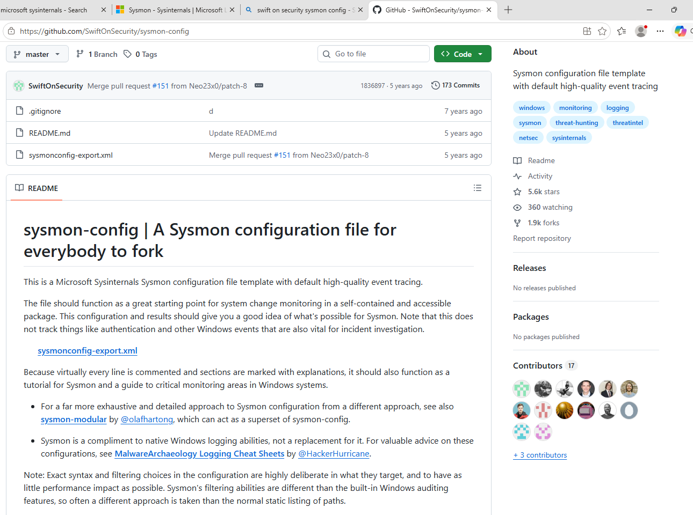
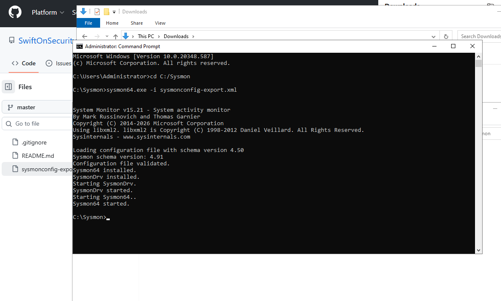
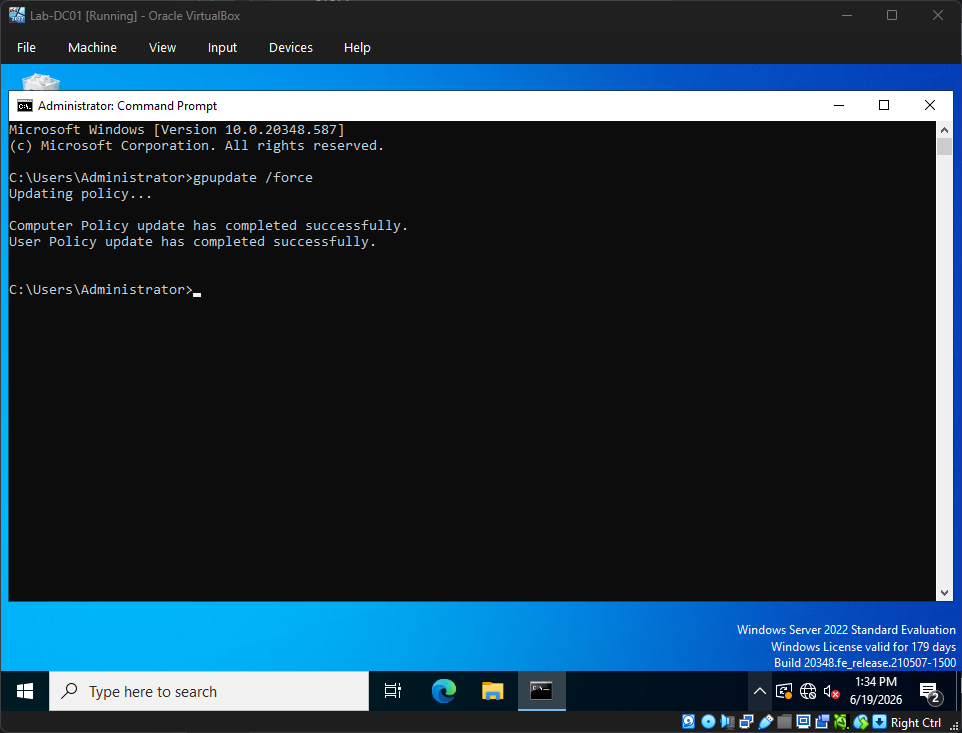
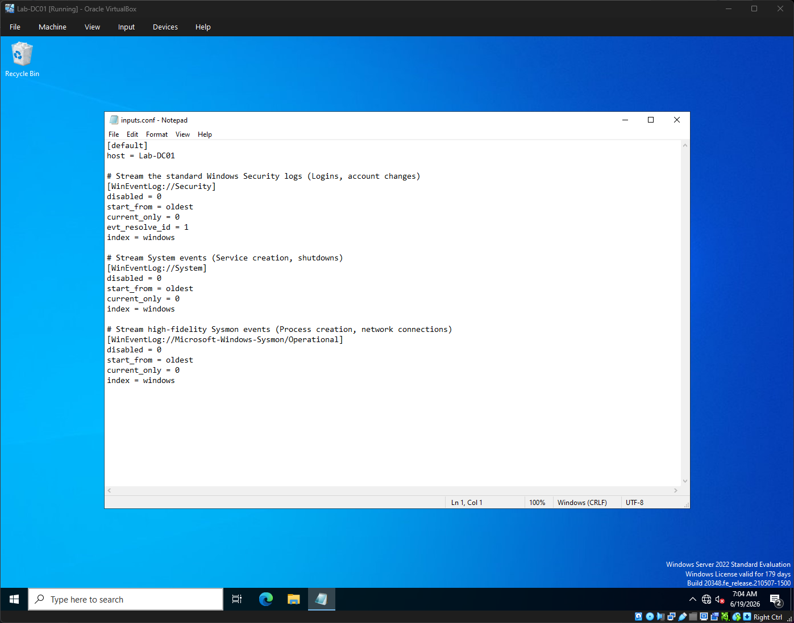
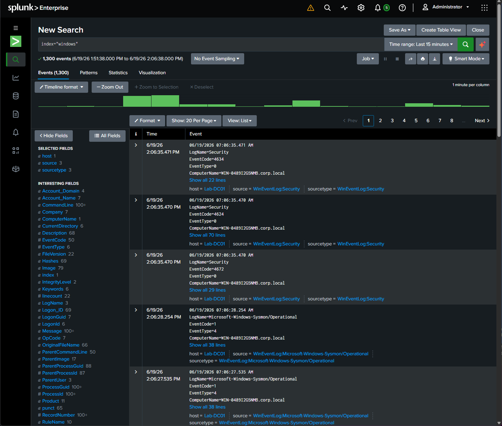

# Sysmon and Log Forwarding

## Purpose

This page documents the Sysmon and Windows log forwarding setup used in my virtual cyber security home lab.

The aim of this part of the project was to improve visibility across the Windows systems in the lab and forward useful telemetry into Splunk for analysis.

This included installing Sysmon, enabling relevant Windows audit logging, configuring the Splunk Universal Forwarder and validating that Windows Security, System and Sysmon logs were being received in Splunk.

---

## Why This Matters

In a SOC environment, analysts depend on logs to understand what has happened on a system or network.

Without useful logs, it is difficult to investigate suspicious activity, detect attacks or understand the timeline of an incident.

This part of the lab helped me practise the process of:

* Generating endpoint telemetry
* Forwarding logs to a SIEM
* Validating log ingestion
* Searching event data in Splunk
* Understanding which logs are useful for detection

---

## Systems Involved

| System                     | Role                                                      |
| -------------------------- | --------------------------------------------------------- |
| Lab-DC01                   | Windows Server 2022 domain controller and log source      |
| Lab-Client01               | Windows client workstation and log source                 |
| Lab-Splunk                 | Splunk Enterprise server receiving forwarded logs         |
| Splunk Universal Forwarder | Agent installed on Windows systems to send logs to Splunk |
| Sysmon                     | Tool used to generate enhanced Windows endpoint telemetry |

---

## Log Sources Collected

The Splunk Universal Forwarder was configured to collect the following Windows logs:

| Log Source         | Purpose                                                                   |
| ------------------ | ------------------------------------------------------------------------- |
| Windows Security   | Captures authentication, audit and security-related events                |
| Windows System     | Captures system-level events and service activity                         |
| Sysmon Operational | Captures enhanced endpoint telemetry such as process and network activity |

These logs were forwarded into the custom Splunk index:

`windows`

---

## Sysmon Deployment

Microsoft Sysmon was installed to improve the quality of Windows endpoint telemetry.

Sysmon gives more detailed visibility than standard Windows logs alone, making it useful for detection and investigation practice.

The SwiftOnSecurity Sysmon configuration was used as a starting point for collecting high-value endpoint events.



*Ref 1: SwiftOnSecurity Sysmon configuration used as a reference.*

Sysmon was installed using the downloaded configuration file:

`sysmon64.exe -i sysmonconfig-export.xml`



*Ref 2: Sysmon installed successfully on the Windows Server domain controller.*

---

## Windows Audit Policy Tuning

To improve visibility of network activity, Windows audit policy settings were adjusted on the domain controller.

The key setting enabled was:

`Audit Filtering Platform Connection`

This setting was configured to capture both successful and failed connection events.

After applying the audit policy change, Group Policy was refreshed using:

`gpupdate /force`



*Ref 3: Group Policy update completed successfully after audit policy changes.*

This was important for later detection work because Windows Filtering Platform events were used to identify network scan activity.

---

## Splunk Universal Forwarder Setup

The Splunk Universal Forwarder was installed on the Windows systems so they could send logs to the Splunk server.

The forwarder was configured to send data to:

`192.168.56.50:9997`

This is the Splunk Enterprise server running in the management network.

The forwarded data was sent into the custom Splunk index:

`windows`

---

## inputs.conf Configuration

A custom `inputs.conf` file was created on the Windows systems.

The file was placed in:

`C:\Program Files\SplunkUniversalForwarder\etc\system\local\`

Example configuration for `Lab-DC01`:

```ini
[default]
host = Lab-DC01

[WinEventLog://Security]
disabled = 0
start_from = oldest
current_only = 0
evt_resolve_id = 1
index = windows

[WinEventLog://System]
disabled = 0
start_from = oldest
current_only = 0
index = windows

[WinEventLog://Microsoft-Windows-Sysmon/Operational]
disabled = 0
start_from = oldest
current_only = 0
index = windows
```

For the client workstation, the host value was adjusted to:

`Lab-Client01`



*Ref 4: Splunk inputs configuration for Windows Security, System and Sysmon logs.*

---

## Log Ingestion Validation

After configuring the forwarder, Splunk was used to confirm that Windows events were being received.

Example Splunk search:

```spl
index="windows"
```

The search returned Windows Security, System and Sysmon events from the lab systems.



*Ref 5: Splunk search showing Windows and Sysmon events received from the domain controller.*

This confirmed that the forwarding pipeline was working.

---

## Telemetry Pipeline

The completed telemetry flow was:

```text
Windows systems
      |
      |  Windows Security, System and Sysmon logs
      v
Splunk Universal Forwarder
      |
      |  TCP 9997
      v
Splunk Enterprise Server
      |
      |  index="windows"
      v
Search, analysis and detection
```

This created a basic end-to-end SIEM telemetry pipeline.

---

## Troubleshooting Notes

### Confirming the correct logs were collected

One of the key checks was making sure that the forwarder was collecting useful logs, not just sending generic system activity.

The `inputs.conf` file was used to explicitly collect:

* Security logs
* System logs
* Sysmon Operational logs

This helped ensure that Splunk received data that would be useful for security analysis and later detection work.

---

### Audit policy and network visibility

During later testing, I found that standard logging was not enough to capture the network activity I wanted to analyse.

To improve visibility, I enabled auditing for Windows Filtering Platform connection events. This allowed the Windows systems to generate events such as allowed and blocked connections, which were useful when analysing network reconnaissance activity.

This reinforced that useful SIEM data depends on both log forwarding and correct logging policy configuration.

---

## Validation Checks

After configuring Sysmon and log forwarding, I validated that:

* Sysmon was installed successfully
* The Sysmon Operational log was available
* The Splunk Universal Forwarder was installed on the Windows systems
* The forwarder was configured to send data to `192.168.56.50:9997`
* Windows Security logs were being forwarded
* Windows System logs were being forwarded
* Sysmon Operational logs were being forwarded
* Events appeared in the Splunk `windows` index
* Splunk searches returned data from the Windows hosts

---

## Skills Practised

This part of the project helped me practise:

* Installing Sysmon
* Using a Sysmon configuration file
* Understanding Windows Event Logs
* Enabling Windows audit policy settings
* Installing Splunk Universal Forwarder
* Configuring Splunk forwarder inputs
* Forwarding Windows logs to Splunk
* Validating SIEM data ingestion
* Searching indexed Windows telemetry
* Understanding the relationship between endpoint logging and SIEM visibility

---

## Security Concepts Practised

This part of the lab helped reinforce:

* Endpoint telemetry
* Centralised log collection
* Windows security auditing
* Sysmon event collection
* SIEM ingestion
* Log source configuration
* Detection visibility
* Evidence collection for investigations

---

## What I Learned

This part of the project helped me understand that SIEM visibility depends on good telemetry.

Installing Splunk was only one part of the process. The Windows systems also needed to be configured to generate useful logs, the forwarders needed to collect the correct log sources, and Splunk needed to receive and index the data correctly.

I also learned that not all useful security events are available by default. Audit policy settings and tools like Sysmon can make a big difference to what an analyst can see during an investigation.

The main takeaway was that detection depends on the full pipeline working properly: endpoint logging, forwarding, indexing and searching.
